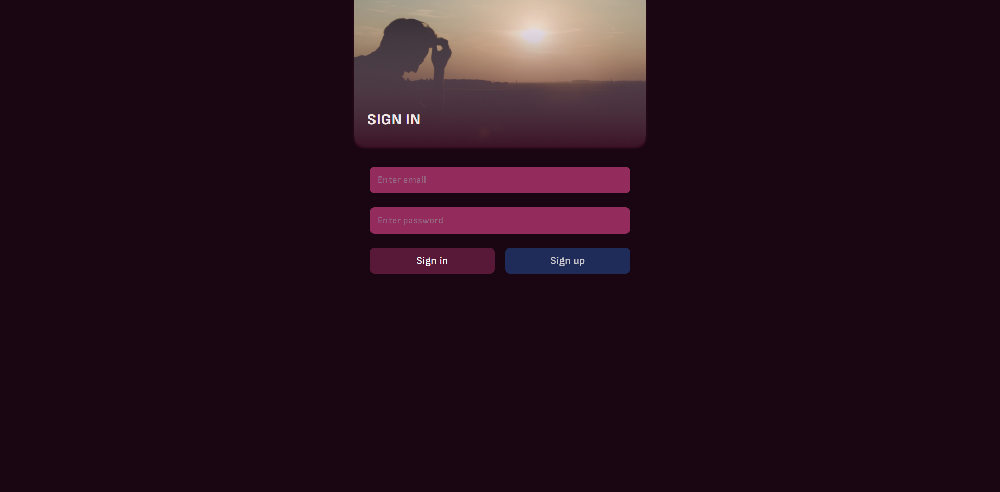
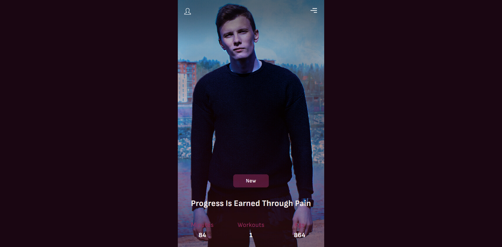
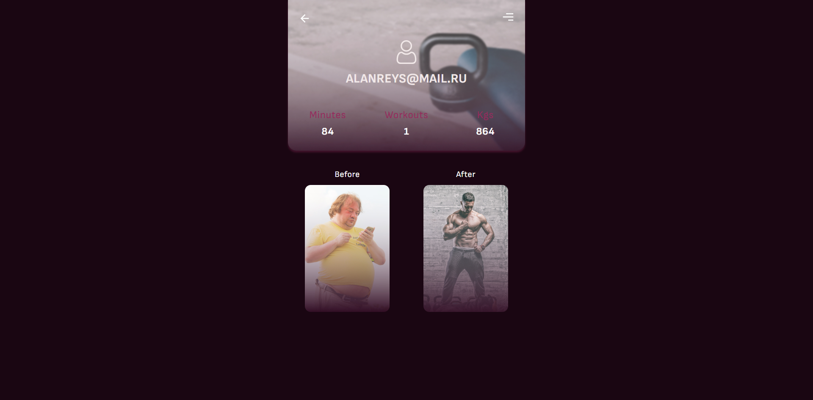
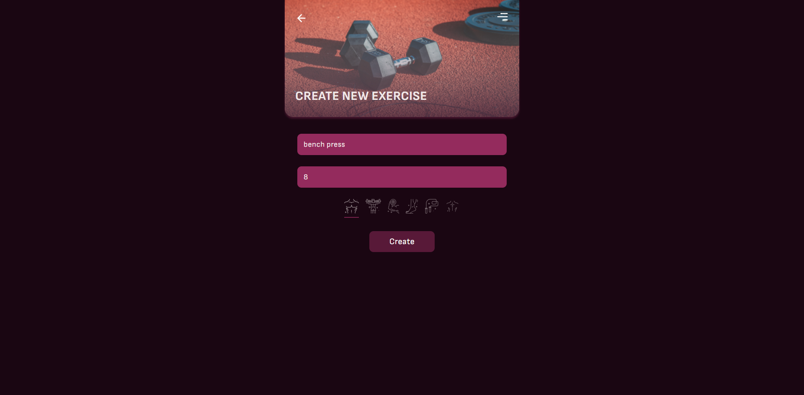
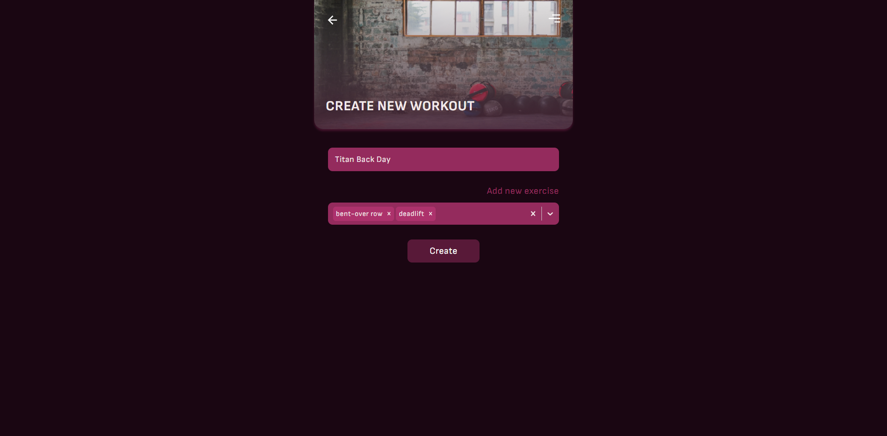
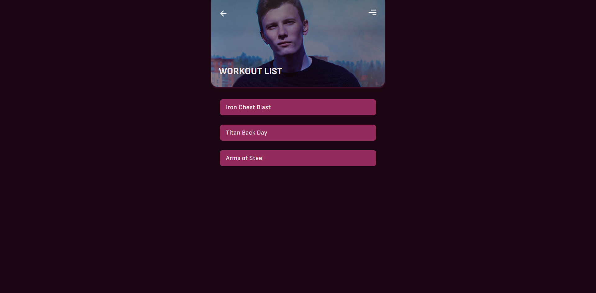
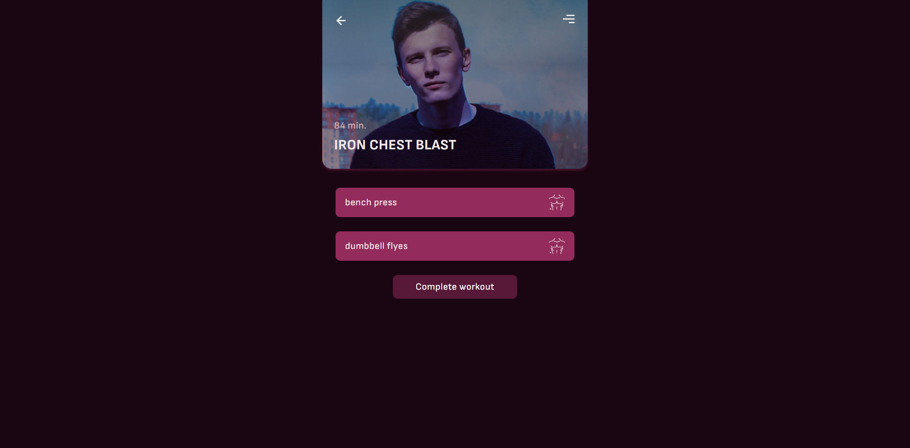
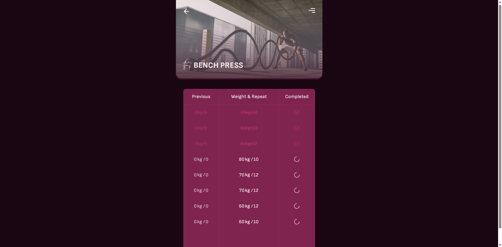

# Workout Frontend

Frontend for the **Workout** educational project.

This project provides a modern React-based user interface for managing workout routines, user authentication, and fitness tracking.

---

## 🧰 Tech Stack

> A quick overview of the main tools and libraries used in this project.

**Core:**

- **React 19** — JavaScript library for building user interfaces
- **Vite** — fast build tool and development server
- **React Router DOM** — client-side routing
- **Sass** — CSS preprocessor for enhanced styling

**State Management & Data Fetching:**

- **TanStack Query** — server state management and caching
- **Axios** — HTTP client for API requests
- **React Hook Form** — performant forms with easy validation

**UI Components & Styling:**

- **React Icons** — popular icon library
- **React Select** — flexible select input control
- **clsx** — utility for constructing className strings conditionally

**Authentication:**

- **js-cookie** — simple cookie handling for authentication tokens

**Development Tools:**

- **ESLint** — JavaScript linting
- **Prettier** + **@trivago/prettier-plugin-sort-imports** — code formatting
- **TypeScript types** — type safety for React components

---

## 📸 Screenshots

This gallery shows the project interface.

#### Authentication (Login/Register)



#### Home dashboard



#### User profile



#### Create new exercise



#### Create new workout



#### Workouts list



#### Workout details



#### Exercise details



---

## ⚙️ Development

This project uses **Yarn** and requires **Node.js v22+**.

**Prerequisites:**

Make sure you have the [workout-server](https://github.com/albert-alanreys/workout-server) running locally before starting the frontend application.

To run the development server:

```bash
yarn install
```

Create a `.env` file based on `.env.example`:

```
VITE_SERVER_URL=http://127.0.0.1:5000
```

Start the development server:

```bash
yarn dev
```

---

**License:** MIT  
**Author:** [Albert Alanreys](https://github.com/albert-alanreys)